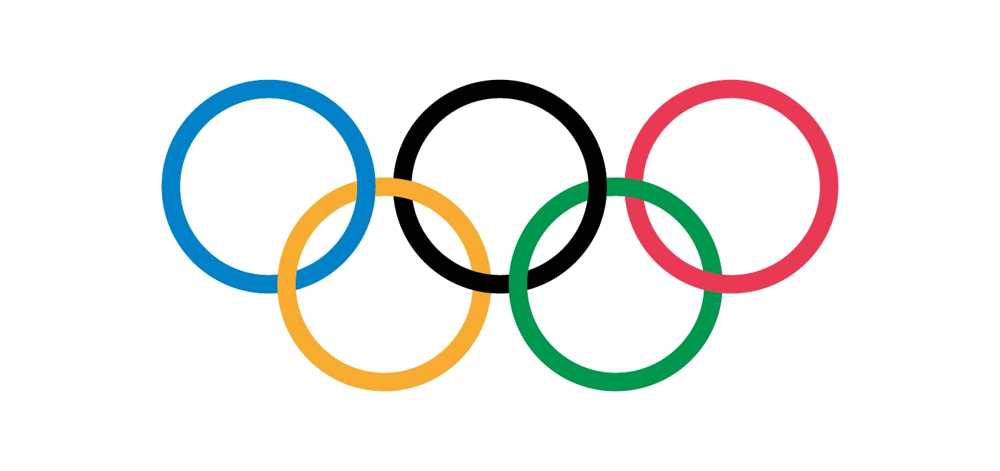

# Analysis of historical Olympic data



This is a data analysis and visualization project that leverages the Streamlit framework to provide interactive insights into Olympic Games data. The application allows users to explore historical Olympic data, analyze trends, and visualize medal distributions across different sports, countries, and years.

## Table of Contents
- [Images](#images)
- [Features](#features)
- [Demo](#demo)
- [Installation](#installation)
- [Usage](#usage)

## Images


## Features

- Visualize Olympic data through interactive charts, tables, and heatmaps.
- Filter and analyze data by sport, country, and year.
- Explore historical trends and patterns in Olympic Games history.
- Easily interact with the data without writing code.

## Live Demo

[Live Demo](https://olympics-data-analysis.streamlit.app/)

## Installation

To run this project locally, follow these steps:

1. Clone the repository to your local machine:

   ```bash
   git clone https://github.com/JatinSingh28/Olympics-Data-Analysis

2. Navigate to the project directory:
    ```bash
    cd Olympics-Data-Analysis

3. Install the project dependencies:
    ```bash
    pip install -r requirements.txt

4. Run the Streamlit app:
    ```bash
    streamlit run app.py

## Usage

1. Open the Streamlit app by following the installation instructions.
2. Explore the available filters and options to interact with the Olympic data.
3. Analyze trends, visualize medal distributions, and gain insights into Olympic history.